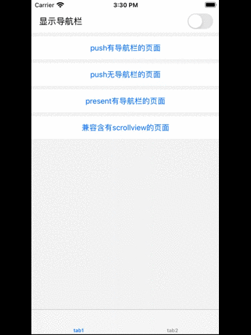

# YHNavigationBar
UINavigationController封装，支持全屏侧滑pop，导航栏显示隐藏更便捷，非入侵。

## Features


## Installation

### CocoaPods (recommended practice)
1. Add following content
```ruby
pod 'YHNavigationBar', :git => 'https://github.com/yelinux/YHNavigationBar.git'
```
 to your `Podfile`.
 
2. Run `pod install` or `pod update`.

### Manually (old school way)
1. Drag the `YHNavigationBar` folder into your project.

2. Add the following to your `.pch` file.
```objective-c
#import "YHNavigationKit.h"
```

## Usage
1. Add the following to your view controller file:
```objective-c
#import "YHNavigationKit.h"
```

2. Create an instance object of UINavigationController:`YHNavigationController`
```objective-c
YHNavigationController *nav = [[YHNavigationController alloc] initWithRootViewController:vc];
```

3. Configure instance object of  UIViewController property if you want:
```objective-c
- (void)viewDidLoad {
    [super viewDidLoad];
    // Do any additional setup after loading the view from its nib.
    self.yh_prefersNavigationBarHidden = YES;  // NavigationBar hidden or not.
    self.yh_interactivePopType = YHViewControllerInteractivePopTypeFullScreen;  //interactive pop gesture or not.
}
```

4. If you want to use fullscreen pop gesture in ViewController with scrollView or subclass of scrollView , you should customize the scrollView or subclass of scrollView and overload the`gestureRecognizer:shouldRecognizeSimultaneouslyWithGestureRecognizer:`method . like this:
```objective-c
- (BOOL)gestureRecognizer:(UIGestureRecognizer *)gestureRecognizer shouldRecognizeSimultaneouslyWithGestureRecognizer:(UIGestureRecognizer *)otherGestureRecognizer{
    if ([otherGestureRecognizer isKindOfClass:[YHNavigationFullScreenPopGesture class]]
        || [@"_UIParallaxTransitionPanGestureRecognizer" isEqualToString:NSStringFromClass([otherGestureRecognizer class])]) {
        return self.contentOffset.x <= 0;
    }

    return NO;
}
```
